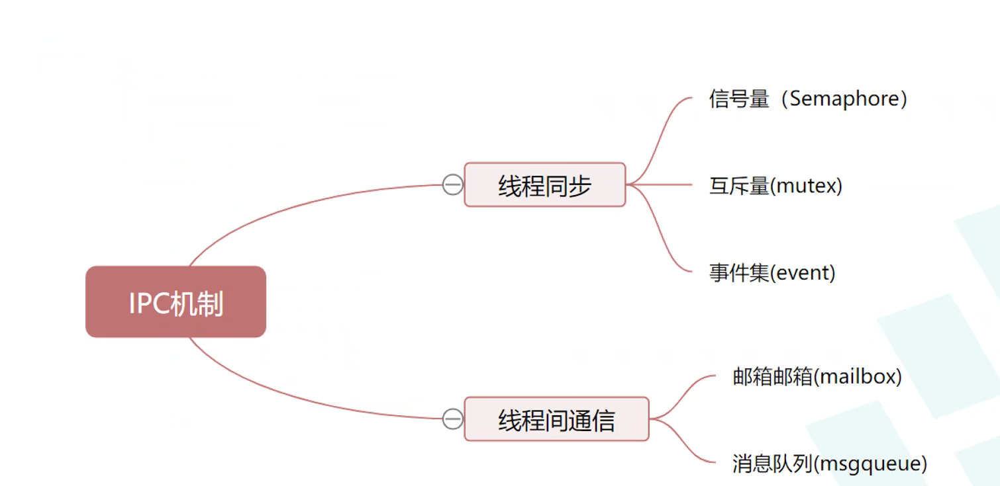
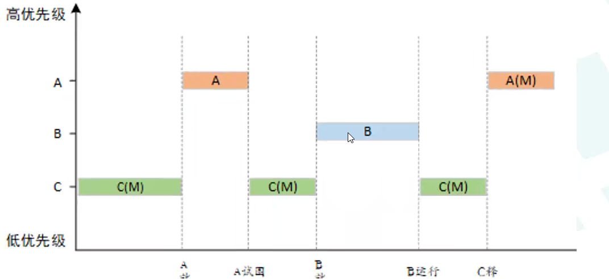
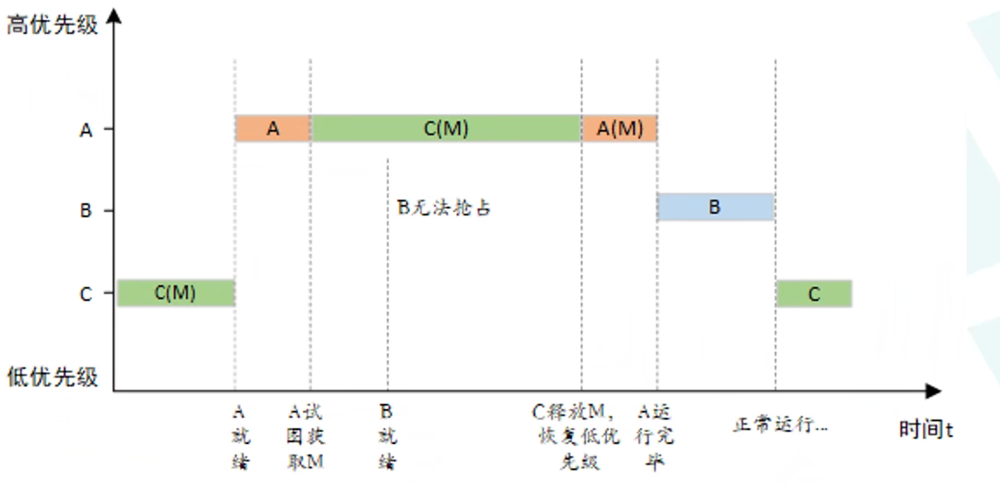
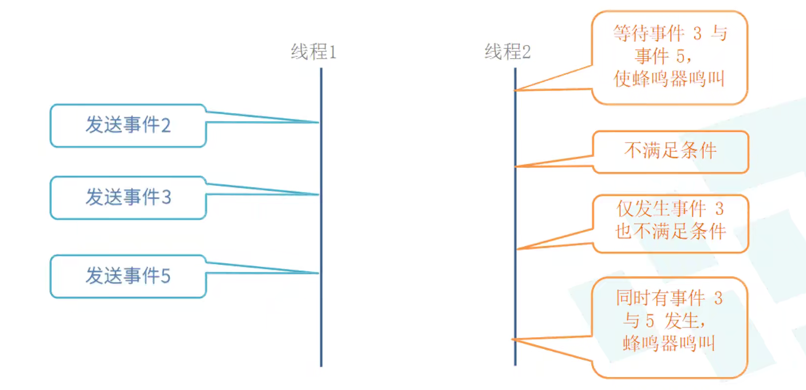

# Day 3 IPC机制


1. √
2. 互斥量
3. 
## 临界区
only one can use the resource at a time

有人用了,别人就不能用

## 阻塞非阻塞
Blocking/Non-blocking
线程/资源都有

阻塞: 等待,一个线程
？？？
非阻塞: 不等待

## 挂起
？？？
<!-- ## 同步
一个线程在等待另一个线程
## 异步
一个线程在等待另一个线程,另一个线程在等待另一个线程 -->

## 死锁
两个线程互相等待，需要对方的资源

<!-- ## 互斥
两个线程不能同时使用资源 -->
## 信号量
约等于停车场剩余车位
用于线程间同步、互斥
- 二值信号量 约等于bool 获得1，不得0

- 计数信号量 初始为期待的值？？？
- 
？？？
- 裸机 根据全局变量flag 反应（错误、破坏、不能挂起一直停在这……？？？）
- 用系统的api，不要flag
- 三种反应：一直等，等一会，不等
api
### √ 创建信号量（动态）节省资源，动态分配，可能内存破坏
？？？
注意区别？
``` c
rt_sem_t rt_sem_create(const char* name, rt_uint32_t value, rt_uint8_t flag);
// flag:RT_IPC_FLAG_FIFO先进先出/RT_IPC_FLAG_PRIO优先级
```
### √ 删除信号量
？？？
``` c
rt_err_t rt_sem_delete(rt_sem_t sem);
```
### 初始化信号量(静态)还在内存，别人也用不了
``` c
rt_err_t rt_sem_init(rt_sem_t sem, const char* name, rt_uint32_t value, rt_uint8_t flag);
```
### 脱离信号量
从内核对象管理器中脱离

### 获取信号量
time 单位tick
？？？

### 无等待获取信号量
``` c
rt_err_t rt_sem_trytake(rt_sem_t sem);
```
### 释放信号量
``` c
rt_err_t rt_sem_release(rt_sem_t sem);
```
## 互斥量
约等于仅有的一把钥匙
保护临界资源
多次获取多次释放？？？

### 优先级反转
高优先级被低优先级阻塞
实时：高优先级先执行
运行需要资源
资源有信号量
临界资源有互斥量
占用资源要先完成才能释放

把A的优先级临时赋C

### 创建和删除???互斥量
``` c
rt_mutex_t rt_mutex_create (const char* name, rt_uint8_t flag);
rt_err_t rt_mutex_delete (rt_mutex_t mutex);

```
无论选择 RT_IPC_FLAG_PRIO 还是 RT_IPC_FLAG_FIFO，内核均按照 RT_IPC_FLAG_PRIO 处理

### 初始化和脱离互斥量
``` c
rt_err_t rt_mutex_init (rt_mutex_t mutex, const char* name, rt_uint8_t flag);
rt_err_t rt_mutex_detach (rt_mutex_t mutex);
```
### 获取互斥量
+1???
``` c
rt_err_t rt_mutex_take (rt_mutex_t mutex, rt_int32_t time);
```
？？？
### 无等待获取互斥量
``` c
rt_err_t rt_mutex_trytake(rt_mutex_t mutex);
```
### 释放互斥量
``` c
rt_err_t rt_mutex_release (rt_mutex_t mutex);
```

## 事件集
？？？一堆事件在32bit中，在线程中与，或判断执行

### 创建事件集
``` c
rt_event_t rt_event_create(const char* name, rt_uint8_t flag);
```
### 删除事件集
？？？唤醒
create用这个
``` c
rt_err_t rt_event_delete(rt_event_t event);
```
### 初始化事件集
``` c
rt_err_t rt_event_init(rt_event_t event, const char* name, rt_uint8_t flag);
```
### 脱离事件集
create 不能用
``` c
rt_err_t rt_event_detach(rt_event_t event);
```
### ……
jssjian

## （消息）邮箱
？？？
4个字节（32位）恰好可以传递指针

### 创建邮箱
``` c
rt_mailbox_t rt_mb_create(const char* name, rt_uint32_t size, rt_uint8_t flag);
```
### 删除邮箱
``` c
rt_err_t rt_mb_delete(rt_mailbox_t mb);
```
### 初始化邮箱
``` c
rt_err_t rt_mb_init(rt_mailbox_t mb, const char* name, rt_uint32_t size, rt_uint8_t flag);
```
### 脱离邮箱

### 等待
不能在中断中使用？？？
### ...

## 消息队列

### 异步通信
1.vs2.

1消息 多线程？
FIFO 对于谁
。。。
[一个好用的串口工具类似mobaxterm](https://wterm.wkjay.com/)