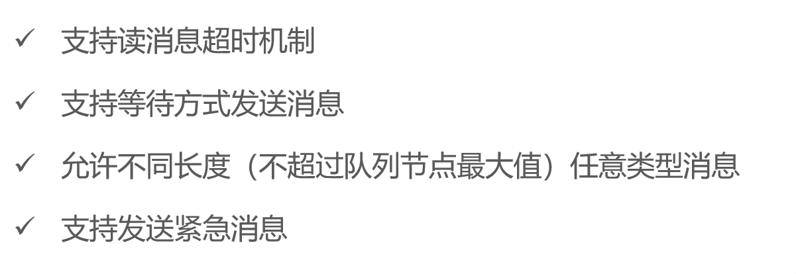
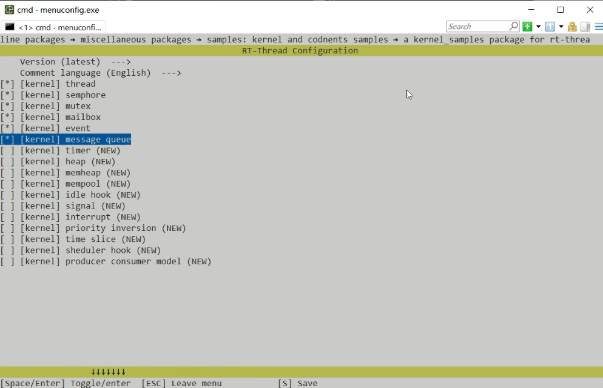

# Day 3 IPC机制
同步是指按预定的先后次序进行运行


1. √
2. 互斥量
3. 挂起：先做其它
   死锁：互相等待……
## 临界区
only one can use the resource at a time

有人用了,别人就不能用

## 阻塞非阻塞
Blocking/Non-blocking
线程阻塞：资源被其它线程占用
阻塞式线程：只能执行当前任务并等待其完成
非阻塞式线程：执行当前任务，还可以做其它事情，完成时收到异步通知

## 挂起
暂时搁置
> 当信号量实例数目为零时，再申请该信号量的线程就会被挂起在该信号量的等待队列上，等待可用的信号量实例（资源）。

把寄存器，线程栈里面的东西保存下来

## 死锁
两个线程互相等待，需要对方的资源

<!-- ## 互斥
两个线程不能同时使用资源 -->
## 信号量
约等于停车场剩余车位
用于线程间同步、互斥
- 有线程释放，信号量+1；有线程获得，信号量-1
- 二值信号量 约等于bool 初始为0，解决同步问题
- 计数信号量 初始为期待的值（允许同时访问同一资源的任务个数）,用于解决资源计数问题
- 裸机 根据全局变量flag 反应（不知道谁修改→错误、逻辑混乱、破坏、不能挂起一直停在这……）
- 用系统的api，不要flag
- 三种反应：一直等，等一会，不等

信号量控制块由结构体 struct rt_semaphore 表示。另外一种 C 表达方式 rt_sem_t
``` c
static rt_sem_t dynamic_sem = RT_NULL;
```
**api**
### √ 创建信号量（动态）节省资源，动态分配，可能内存破坏
从对象管理器中分配一个semaphore对象，……
当信号量不可用时的线程排队方式flag:RT_IPC_FLAG_FIFO先进先出/RT_IPC_FLAG_PRIO优先级
注意区别？
``` c
rt_sem_t rt_sem_create(const char* name, rt_uint32_t value, rt_uint8_t flag);
```
### √ 删除信号量（动态）
（适用于动态创建的信号量）
删除信号量以释放系统资源。如果删除该信号量时，有线程正在等待该信号量，那么删除操作会先唤醒等待在该信号量上的线程（等待线程的返回值是 - RT_ERROR），然后再释放信号量的内存资源
``` c
rt_err_t rt_sem_delete(rt_sem_t sem);
```
### 初始化信号量(静态)还在内存，不用了别人也用不了
``` c
rt_err_t rt_sem_init(rt_sem_t sem, const char* name, rt_uint32_t value, rt_uint8_t flag);
```
### 脱离信号量
从内核对象管理器中脱离 ,原来挂起在信号量上的等待线程将获得 - RT_ERROR 的返回值
``` c
rt_err_t rt_sem_detach(rt_sem_t sem);
```
### 获取信号量
time 单位tick/RT_WAITING_FOREVER

RT_EOK:成功获得信号量
-RT_ETIMEOUT:超时依然未获得信号量
-RT_ERROR:其他错误
``` c
rt_err_t rt_sem_take(rt_sem_t sem, rt_int32_t time);
```

### 无等待获取信号量
``` c
rt_err_t rt_sem_trytake(rt_sem_t sem);
```
### 释放信号量
``` c
rt_err_t rt_sem_release(rt_sem_t sem);
```
## 互斥量（互斥锁）
约等于仅有的一把钥匙
保护临界资源
1. 互斥量所用权
2. 防止优先级反转
### 优先级反转
高优先级被低优先级阻塞
实时：高优先级先执行
运行需要资源
资源有信号量
临界资源有互斥量
占用资源要先完成才能释放

把A的优先级临时赋C

### 创建和删除互斥量
无论选择 RT_IPC_FLAG_PRIO 还是 RT_IPC_FLAG_FIFO，内核均按照 RT_IPC_FLAG_PRIO 处理

``` c
rt_mutex_t rt_mutex_create (const char* name, rt_uint8_t flag);
rt_err_t rt_mutex_delete (rt_mutex_t mutex);

```

### 初始化和脱离互斥量
``` c
rt_err_t rt_mutex_init (rt_mutex_t mutex, const char* name, rt_uint8_t flag);
rt_err_t rt_mutex_detach (rt_mutex_t mutex);
```
### 获取互斥量
如果互斥量已经被当前线程控制，在当前线程再一次获取，那么该互斥量的持有计数+1，当前线程不会挂起
``` c
rt_err_t rt_mutex_take (rt_mutex_t mutex, rt_int32_t time);
```

### 无等待获取互斥量
``` c
rt_err_t rt_mutex_trytake(rt_mutex_t mutex);
```

### 释放互斥量
信号量：谁都可以获取，谁都可以释放
互斥量：只有拥有互斥量控制权的线程才可以释放，每释放一次，持有计数-1，当持有计数为0时，才变为可用
``` c
rt_err_t rt_mutex_release (rt_mutex_t mutex);
```

## 事件集
一堆事件在32bit中（32个事件0/1），在线程中与，或判断执行
- 发送： 从中断/线程中
- 接收： 线程接收，条件检查

### 创建事件集
``` c
rt_event_t rt_event_create(const char* name, rt_uint8_t flag);
```

### 删除事件集
删除前唤醒所有挂起在该事件集上的线程，返回`-RT_ERROR`
create用这个
``` c
rt_err_t rt_event_delete(rt_event_t event);
```

### 初始化事件集
静态事件集对象的内存一般放于**读写数据段**或**未初始化数据段**中
``` c
rt_err_t rt_event_init(rt_event_t event, const char* name, rt_uint8_t flag);
```
 
### 脱离事件集
create 不能用
``` c
rt_err_t rt_event_detach(rt_event_t event);
```
### 发送事件集
set 即我们要发送的（1<<n）
`rt_err_t rt_event_send(rt_event_t event, rt_uint32_t set);`
### 接收事件集
set :当前目标需要的事件
option ： RT_EVENT_FLAG_OR  RT_EVENT_FLAG_AND
recved : 接收到刚发送的事件
```c 
rt_err_t rt_event_recv(rt_event_t event,
                           rt_uint32_t set,
                           rt_uint8_t option,
                           rt_int32_t timeout,
                           rt_uint32_t* recved);

```


## （消息）邮箱
也叫交换信息
4个字节（32位）恰好可以传递指针

### 创建邮箱
这块内存的大小等于邮件大小（4 字节）与邮箱容量(size)的乘积
``` c
rt_mailbox_t rt_mb_create(const char* name, rt_uint32_t size, rt_uint8_t flag);
```
### 删除邮箱
``` c
rt_err_t rt_mb_delete(rt_mailbox_t mb);
```
### 初始化邮箱
``` c
  rt_err_t rt_mb_init(rt_mailbox_t mb,
                    const char* name,
                    void* msgpool,
                    rt_size_t size,
                    rt_uint8_t flag)

```
### 发送邮件

``` c
rt_err_t rt_mb_send (rt_mailbox_t mb, rt_uint32_t value);
```

### 等待方式发送
邮箱满了可以等待一段时间，不能在中断中使用

### 接收邮件
地址存到val ue
``` c 
rt_err_t rt_mb_recv (rt_mailbox_t mb, rt_uint32_t* value, rt_int32_t timeout);
```
### ...


## 消息队列

### 异步通信
超时机制即timeout

FIFO ：线程先得到先进入消息队列的消息
RT_IPC_FLAG_FIFO 或 RT_IPC_FLAG_PRIO ：哪个线程先
### 创建消息队列
区别：rt_size_t msg_size, rt_size_t max_msgs,
``` c
rt_mq_t rt_mq_create(const char* name,
                     rt_size_t msg_size,
                     rt_size_t max_msgs,
                     rt_uint8_t flag);
```

### 发送
中断里面不可以用`rt_mq_send_wait`
``` c
rt_err_t rt_mq_send (rt_mq_t mq, void* buffer, rt_size_t size);
```
IPC示例

[示例代码在这里](.\packages\kernel_samples-latest\zh)
[一个好用的串口工具类似mobaxterm](https://wterm.wkjay.com/)

配置完任何软件包都要在env中
``` c
pkgs --update
```

## 按键灭灯实践
### 灭了怎么点都不亮
因为按键按灭就没再点亮
在key线程循环开始每次点亮？
### 灯轻微闪烁，几乎看不出
不能及时获取？用无等待获取信号量？
### 还是一样……
因为采用了延时防止误触，判断是否按下按键花了一点时间
~~只要知道按键没有按下就亮灯就行~~
在下次判断按键没按下之后再亮灯
### 居然在按键的线程在控制led
改为没摁才释放信号量，led线程获取到后设为亮灯
并在获取信号量前将led设为灭灯
``` c
#include <board.h>
#include <rtthread.h>
#include <drv_gpio.h>
#ifndef RT_USING_NANO
#include <rtdevice.h>
#endif /* RT_USING_NANO */

#define GPIO_LED_B    GET_PIN(F, 11)
#define GPIO_LED_R    GET_PIN(F, 12)

#define THREAD_PRIORITY         25
#define THREAD_STACK_SIZE       1024
#define THREAD_TIMESLICE        5

#define PIN_KEY0  GET_PIN(C,0)

static rt_thread_t tid1 = RT_NULL;
static rt_thread_t tid2 = RT_NULL;

static void key_name_entry(void *parameter);
static void led_name_entry(void *parameter);
static rt_sem_t dynamic_sem = RT_NULL;

int main(void)
{
    rt_pin_mode(GPIO_LED_R, PIN_MODE_OUTPUT);
    rt_pin_mode(PIN_KEY0, PIN_MODE_INPUT_PULLUP);

    dynamic_sem = rt_sem_create("dsem", 0, RT_IPC_FLAG_PRIO);
    if (dynamic_sem == RT_NULL)
    {
        rt_kprintf("create dynamic semaphore failed.\n");
        return -1;
    }
    else
    {
        rt_kprintf("create done. dynamic semaphore value = 0.\n");
    }

    tid1 = rt_thread_create("key_thread",
                            key_name_entry, RT_NULL,
                            THREAD_STACK_SIZE,
                            THREAD_PRIORITY, THREAD_TIMESLICE);
    if (tid1 != RT_NULL)
    {
        rt_thread_startup(tid1);
    }

    tid2 = rt_thread_create("led_thread",
                            led_name_entry, RT_NULL,
                            THREAD_STACK_SIZE,
                            THREAD_PRIORITY, THREAD_TIMESLICE);
    if (tid2 != RT_NULL)
    {
        rt_thread_startup(tid2);
    }

    // while (1)
    // {
    //     rt_pin_write(GPIO_LED_R, PIN_HIGH);
    //     rt_thread_mdelay(500);
    //     rt_pin_write(GPIO_LED_R, PIN_LOW);
    //     rt_thread_mdelay(500);
    // }
}
static void key_name_entry(void *parameter)
{
    rt_uint32_t count=0;
    while (1)
    {
        if(rt_pin_read(PIN_KEY0) == PIN_LOW)
        {
            rt_thread_mdelay(100);
            if(rt_pin_read(PIN_KEY0) == PIN_LOW)
            {
                rt_kprintf("key0 is pressed (%d) ", count++);
                    // rt_sem_release(dynamic_sem);
            }
            else
            {
                rt_sem_release(dynamic_sem);
            }
        }
        else
        {
            rt_sem_release(dynamic_sem);
        }
        rt_thread_mdelay(10);
    }
    
}

static void led_name_entry(void *parameter)
{
    rt_uint32_t count=0;
    rt_uint32_t result=0;
    while (1)
    {
        rt_pin_write(GPIO_LED_R, PIN_HIGH);
        result = rt_sem_take(dynamic_sem, RT_WAITING_FOREVER);
        if (result == RT_EOK)
        {            
            // rt_kprintf("LED LOW\n");
            rt_pin_write(GPIO_LED_R, PIN_LOW);
        }
        
        rt_thread_mdelay(10);
    }
}
```

